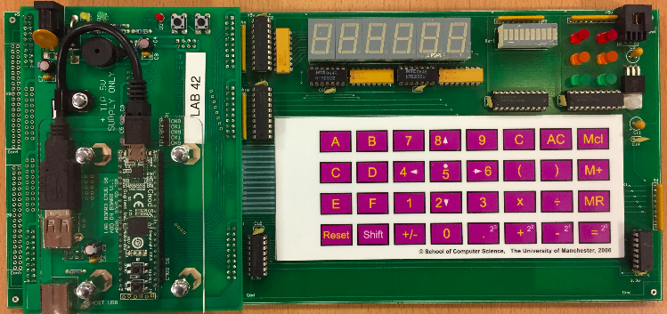

# MU0 VM & Compiler

## Instructions

### Install

In order to install this, either download the binaries from the [GitHub page](https://github.com/thee-engineer/mu0/releases) or have [Go](https://golang.org/dl/) installed and run the following command:

```shell
go get github.com/thee-engineer/mu0
```

### Usage

After either installing or compiling the program:

```shell
mu0 build source.s source.o # This will compile the given source to a binary
mu0 run source.o # Execute the binary
```

### Build

Nothing special other then Go is required to build both the compiler and VM.

```shell
git clone git@github.com:thee-engineer/mu0.git
cd mu0
go build mu0.go
```

## Description

`mu0` is both a VM for the MU0 Micro Processor (single
accumulator register, PC register and no SP originally or any other capabilities).
`mu0` also acts as a compiler for the small assembly instruction set (4 bit). The compiler
has extra instructions and compiler directives defined, and some aliases for ARM ASM.

### Instruction Set

| Code | Mnemonic | Use      | Description                                               |
|------|-----------|----------|-----------------------------------------------------------|
| 0000 | LDA       | LDA S    | Load the value `S` into the `ACC`                         |
| 0001 | STA       | STA S    | Store the value from `ACC` into `S`                       |
| 0010 | ADD       | ADD S    | Add `S` to `ACC` (`ACC = ACC + S`)                        |
| 0011 | SUB       | SUB S    | Sub `S` from `ACC` (`ACC = ACC - S`)                      |
| 0100 | JMP       | JMP S    | Set the `PC` to the value of `S`                          |
| 0101 | JGE       | JGE S    | Set the `PC` to the value of `S` if `ACC >= 0`            |
| 0110 | JNE       | JNE S    | Set the `PC` to the value of `S` if `ACC != 0`            |
| 0111 | STP       | STP S    | Stop the program from running. `S` will be the exit code  |
| 1000 | BRK       | BRK      | Pause the program execution, action must be taken         |
| 1001 | SLP       | SLP S    | VM level implementation of `sleep` to avoid idle-spin, sleep S ms     |

### University of Manchester

The boards provided by the University of Manchester (which inspired me to make this program) look like this:


## Specifications

## TODO

- [ ] Add optional SP, LR to the MU0 VM (with instruction set)
- [ ] Add register operations to the compiler
- [ ] Implement BRK, SLP operations
- [ ] Implement peripherals for the VM (keypad, LCD display)
- [ ] Implement INCLUDE compiler directive
- [ ] Implement interactive VM mode
- [ ] Implement flags for compiler and VM
